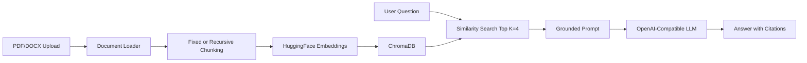

# DocSensei

DocSensei is a production-ready Retrieval-Augmented Generation application for answering questions from uploaded PDF and DOCX documents. It extracts text, chunks content, embeds it with `sentence-transformers/all-MiniLM-L6-v2`, stores vectors in ChromaDB, and answers through an OpenAI-compatible chat interface.

The assistant is intentionally grounded: if the answer is not present in the uploaded document, it must respond exactly:

```text
I do not know. The answer is not available in the uploaded document.
```

Every answer includes citations with document name, page number, and chunk ID.

## Architecture

```text
Upload -> Loader -> Chunker -> Embeddings -> ChromaDB -> Retriever -> Prompt -> LLM -> Cited Answer
```



## Project Structure

```text
DocSensei/
  app.py
  config.py
  loaders/
  preprocessing/
  embeddings/
  database/
  prompts/
  chains/
  services/
  ui/
  evaluation/
  tests/
  deployment/
  uploads/
  vectorstore/
```

## Features

- Multi-file PDF and DOCX upload
- Persistent uploaded file saving
- PDF and DOCX text extraction
- Fixed chunking with `chunk_size=500`, `overlap=100`
- Recursive character chunking with `chunk_size=500`, `chunk_overlap=100`
- ChromaDB vector storage
- Metadata for document name, page number, chunk ID, and source
- Similarity retrieval with Top K = 4
- Chat memory for the current Streamlit session
- Document, page, and chapter-oriented summaries
- Beginner, intermediate, and advanced explanations
- Semantic search
- Retrieval evaluation utilities for retrieval accuracy, Precision@K, Recall@K, and response time
- Graceful handling for invalid files, empty documents, corrupted PDFs, missing API keys, and empty indexes

## Installation

Use Python 3.12.

```bash
cd DocSensei
python -m venv .venv
source .venv/bin/activate
python -m pip install --upgrade pip
pip install -r requirements.txt
cp .env.example .env
```

On Windows PowerShell:

```powershell
cd DocSensei
py -3.12 -m venv .venv
.\.venv\Scripts\Activate.ps1
python -m pip install --upgrade pip
pip install -r requirements.txt
Copy-Item .env.example .env
```

## Configuration

Edit `.env`:

```env
LLM_PROVIDER=openai
LLM_MODEL=gpt-4o-mini
LLM_API_KEY=your-api-key
LLM_BASE_URL=
LLM_TEMPERATURE=0.0
CHROMA_PERSIST_DIR=vectorstore
UPLOAD_DIR=uploads
TOP_K=4
EMBEDDING_MODEL=sentence-transformers/all-MiniLM-L6-v2
LOG_LEVEL=INFO
```

For Groq, Gemini, or another OpenAI-compatible provider, set `LLM_BASE_URL`, `LLM_MODEL`, and `LLM_API_KEY` for that provider. No project structure changes are required.

## Usage

```bash
streamlit run app.py
```

Then:

1. Upload one or more PDF or DOCX files.
2. Select Fixed Chunking or Recursive Character chunking.
3. Click Create Index.
4. Ask questions in Chat.
5. Inspect citations and retrieved chunks.
6. Use Semantic Search, Summary, and Explain tabs as needed.

## Screenshots

Add screenshots here after running locally:

- Sidebar upload and indexing
- Chat answer with citations
- Semantic search results
- Summary and explanation views

## Evaluation

The `evaluation/` package contains reusable metric functions and report generation. Provide labeled queries in this shape:

```python
queries = [
    {"query": "What is the policy renewal period?", "expected_chunk_ids": ["policy.pdf:p3:c2"]}
]
```

Then run both chunking strategies against the same documents and write a Markdown report with `write_markdown_report`.

## AWS EC2 Free Tier Deployment

Target: Ubuntu 22.04.

```bash
git clone <your-repo-url> DocSensei
cd DocSensei
bash deployment/install_ubuntu.sh
nano .env
bash deployment/run_streamlit.sh
```

Open port `8501` in the EC2 security group. For a persistent service:

```bash
sudo cp deployment/docsensei.service /etc/systemd/system/docsensei.service
sudo systemctl daemon-reload
sudo systemctl enable docsensei
sudo systemctl start docsensei
sudo systemctl status docsensei
```

## Streamlit Community Cloud Deployment

1. Push the project to GitHub.
2. Set `app.py` as the entry point.
3. Add secrets matching `.env.example`.
4. Deploy.

For larger documents, prefer EC2 or another VM because embedding models and Chroma persistence need more predictable disk and memory.

## Troubleshooting

- Missing API key: set `LLM_API_KEY` in `.env`.
- No answer: verify the uploaded document contains the requested information.
- Empty PDF: scanned PDFs without OCR text cannot be extracted by PyPDF.
- Slow first run: Sentence Transformers downloads the embedding model on first use.
- Chroma issues: click Clear Database or delete the `vectorstore/` contents.
- DOCX page numbers: DOCX files are assigned page `1` because page layout is not stable without rendering.

## Future Improvements

- OCR support for scanned PDFs
- Authentication and user-specific workspaces
- Hybrid lexical plus vector search
- Reranking
- Batch evaluation UI
- Docker deployment
- Citation verification pass before answer display
